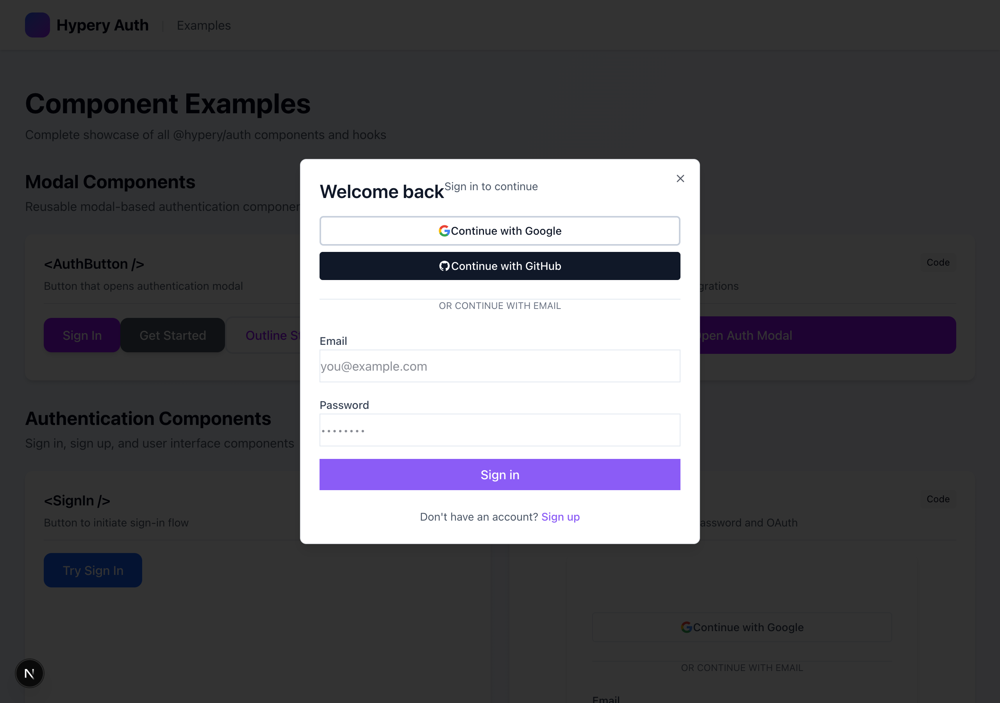

# @hyperyai/sdk

Drop-in authentication and error handling library for Hypery apps. Simple, secure, and built for React.

This package provides everything you need for OAuth authentication, user management, and structured error handling (spending limits, insufficient credits, etc.) in your Hypery applications.

Inspired by [Clerk](https://clerk.com/react-authentication), but purpose-built for Hypery's OAuth system.

## 📸 Component gallery

See **[docs/COMPONENTS.md](./docs/COMPONENTS.md)** for a visual reference of every component with live screenshots and usage.



## Features

- 🔐 **Secure OAuth 2.0 + PKCE** - Industry-standard authentication
- ⚛️ **React-first** - Hooks and components that feel natural
- 🎨 **Customizable** - Bring your own UI or use our defaults
- 📦 **Tiny** - Minimal dependencies, maximum performance
- 🔄 **Auto-refresh** - Seamless token management
- 💾 **Flexible storage** - localStorage, sessionStorage, or memory

## Installation

```bash
npm install @hyperyai/sdk
```

The package ships compiled JavaScript with type declarations (plus the TypeScript
source under `src/` for reference), so it works out of the box — no
`transpilePackages` or build configuration needed.

## Local development against this repo

To develop `@hyperyai/sdk` alongside a consuming app, use
[yalc](https://github.com/wclr/yalc) (npm link duplicates React and breaks hooks):

```bash
# in hypery-sdk
npm i -g yalc
yalc publish            # builds via prepack and stores the real pack output
# in your app
yalc add @hyperyai/sdk && npm install

# iterate: rebuild + push updates into consumers
yalc push               # in hypery-sdk, after changes

# before committing your app
yalc remove --all && npm install
```

## Quick Start

### 1. Wrap your app with `HyperyProvider`

```tsx
import { HyperyProvider } from '@hyperyai/sdk';

function App() {
  return (
    <HyperyProvider
      config={{
        clientId: 'your-client-id',
        redirectUri: 'http://localhost:3000/callback',
        gatewayUrl: 'https://hypery.ai',
        // Optional: defaults to ['read', 'write', 'ai:chat', 'ai:completions', 'ai:models', 'billing:read']
        scopes: ['read', 'write', 'ai:chat', 'ai:completions', 'ai:models', 'billing:read'],
      }}
    >
      <YourApp />
    </HyperyProvider>
  );
}
```

### 2. Use authentication components

```tsx
import { SignedIn, SignedOut, SignIn, UserButton } from '@hyperyai/sdk';

function YourApp() {
  return (
    <>
      <SignedIn>
        <header>
          <h1>Welcome!</h1>
          <UserButton showUserInfo />
        </header>
        <Dashboard />
      </SignedIn>

      <SignedOut>
        <div className="login-page">
          <h1>Sign in to continue</h1>
          <SignIn buttonText="Sign in with Hypery" />
        </div>
      </SignedOut>
    </>
  );
}
```

### 3. Access user data with hooks

```tsx
import { useUser, useHyperyAuth } from '@hyperyai/sdk';

function Dashboard() {
  const { user, isLoading } = useUser();
  const { logout } = useHyperyAuth();

  if (isLoading) return <div>Loading...</div>;

  return (
    <div>
      <h1>Welcome, {user?.name}!</h1>
      <p>Email: {user?.email}</p>
      <button onClick={logout}>Sign out</button>
    </div>
  );
}
```

## Components

### `<HyperyProvider />`

The main provider component. Wrap your app with this.

```tsx
<HyperyProvider
  config={{
    clientId: string;           // Your OAuth client ID
    redirectUri: string;        // Callback URL after auth
    gatewayUrl: string;         // Hypery API URL
    scopes?: string[];          // OAuth scopes (default: ['read', 'write'])
    storage?: 'localStorage' | 'sessionStorage' | 'memory'; // Storage type
  }}
>
  {children}
</HyperyProvider>
```

### Authentication Components

**`<SignIn />`** - Sign-in button

```tsx
<SignIn 
  buttonText="Sign in with Hypery"
  variant="primary"  // 'primary' | 'secondary' | 'outline'
  className="custom-button-class"
/>
```

**`<SignUp />`** - Sign-up button

```tsx
<SignUp 
  buttonText="Get Started"
  variant="primary"
  onSignUpStart={() => console.log('Starting signup')}
/>
```

**`<SignInForm />`** - Embedded login form with social OAuth

Full-featured login form with GitHub, Google, and email/password authentication.

```tsx
<SignInForm 
  showCard
  showTitle
  showSocial  // Show GitHub and Google buttons
  showEmailPassword  // Show email/password form
  title="Welcome back"
  description="Sign in to your account"
  onSuccess={() => console.log('Logged in!')}
  onError={(error) => console.error(error)}
/>
```

```tsx
// Social auth only (no email/password)
<SignInForm 
  showCard
  showSocial={true}
  showEmailPassword={false}
/>
```

**`<UserButton />`** - User avatar with dropdown menu

```tsx
<UserButton 
  showUserInfo
  size="md"  // 'sm' | 'md' | 'lg'
  renderDropdown={(user, logout) => (
    <div>
      <p>{user.name}</p>
      <button onClick={logout}>Sign out</button>
    </div>
  )}
/>
```

**`<UserProfile />`** - User profile card

```tsx
<UserProfile 
  showExtended
  showLoading
/>
```

### Control Components

**`<SignedIn>`** - Only renders when user is authenticated

```tsx
<SignedIn>
  <Dashboard />
</SignedIn>
```

**`<SignedOut>`** - Only renders when user is NOT authenticated

```tsx
<SignedOut>
  <SignIn />
</SignedOut>
```

**`<Protect>`** - Protects content and redirects if needed

```tsx
<Protect fallback={<SignIn />}>
  <ProtectedContent />
</Protect>
```

**`<RedirectToSignIn />`** - Immediately redirects to sign in

```tsx
<RedirectToSignIn />
```

## Hooks

### `useAuth()` (Alias for `useHyperyAuth()`)

Full auth context with methods. Matches Clerk's API pattern.

```tsx
const {
  user,                    // Current user
  isAuthenticated,         // Auth status
  isLoading,               // Loading state
  error,                   // Error message
  login,                   // Initiate login
  logout,                  // Sign out
  refreshAuth,             // Manually refresh
  getAccessToken,          // Get valid access token
} = useAuth();
```

### `useUser()`

Access current user data only.

```tsx
const { user, isLoading } = useUser();

// user object contains:
// - id: string
// - name: string
// - email: string
// - image?: string
```

### `useHyperyAuth()`

Same as `useAuth()`, but with explicit naming.

```tsx
const auth = useHyperyAuth();
```

## Advanced Usage

### Custom storage

```tsx
<HyperyProvider
  config={{
    // ...other config
    storage: 'sessionStorage', // or 'memory' for SSR
  }}
>
```

### Manual token management

```tsx
import { useHyperyAuth } from '@hyperyai/sdk';

function MyComponent() {
  const { getAccessToken } = useHyperyAuth();

  const makeAuthenticatedRequest = async () => {
    const token = await getAccessToken();
    
    const response = await fetch('/api/data', {
      headers: {
        Authorization: `Bearer ${token}`,
      },
    });
    
    return response.json();
  };
}
```

### Custom UI

Build your own UI using the hooks:

```tsx
import { useHyperyAuth } from '@hyperyai/sdk';

function CustomLoginButton() {
  const { login, isLoading } = useHyperyAuth();

  return (
    <button
      onClick={login}
      disabled={isLoading}
      className="my-custom-button"
    >
      {isLoading ? 'Loading...' : 'Sign in'}
    </button>
  );
}
```

## Environment Variables

Create a `.env.local` file:

```env
NEXT_PUBLIC_OAUTH_CLIENT_ID=your_client_id
NEXT_PUBLIC_REDIRECT_URI=http://localhost:3000/callback
NEXT_PUBLIC_AUTH_URL=https://hypery.ai
```

## Error handling: payment & auth modals

When a gateway request is blocked mid-flow, the SDK lets you pop a **payment**
modal (out of credits / spending limit / card issue) or trigger **re-auth**
(expired/invalid token). This is **opt-in** — the SDK does not install a global
fetch interceptor, so you wire it into your own API calls.

Errors arrive as a JSON envelope. Classify on `error.code` (status is a
fallback only — spending-limit is `429`, insufficient-credits/payment is `402`,
auth is `401`):

```jsonc
{ "error": { "code": "INSUFFICIENT_CREDITS",    "type": "insufficient_credits_error" } }
{ "error": { "code": "SPENDING_LIMIT_EXCEEDED",  "type": "spending_limit_error" } }
{ "error": { "code": "PAYMENT_METHOD_REQUIRED",  "type": "payment_method_required_error" } }
{ "error": { "code": "PAYMENT_DECLINED",         "type": "payment_declined_error" } }
{ "error": { "code": "UNAUTHENTICATED",          "type": "authentication_error" } }
```

`useError().setError(body)` accepts the raw `{ error: { code } }` envelope **or**
an already-unwrapped object, and falls back to the HTTP status (`402`/`401`) when
the body has no recognized `code`. It exposes `isBillingRestriction` (any of the
payment/credit/limit cases) and `isAuth` (a `401`) so you can drive
`RestrictionModal` and `AuthModal` respectively. The guards
`isBillingRestriction(body)` and `isAuthError(body)` are also exported for use
outside the hook.

## Examples

See the `/apps/chat` and `/apps/imagine` directories for complete working examples.

## License

MIT

