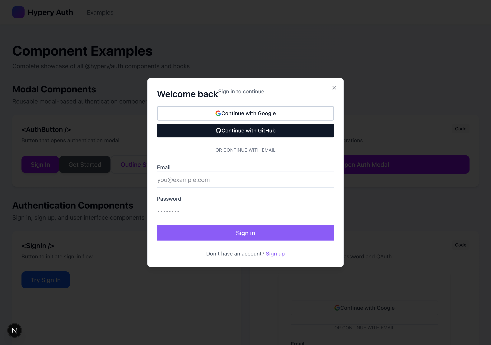

# @hyperyai/sdk

Drop-in authentication, checkout and error handling for React apps built on
[Hypery](https://hypery.ai). Sign users in with OAuth 2.0 + PKCE, call AI models
on their behalf, charge them (one-off purchases, credit top-ups, subscriptions)
and resolve billing/auth errors with ready-made UI.



## Installation

```bash
npm install @hyperyai/sdk
```

Peer dependencies: `react` and `react-dom` 18 or 19. The package ships compiled
JavaScript with type declarations (plus the TypeScript source under `src/` for
reference), so no `transpilePackages` or build configuration is needed.
Components use Tailwind utility classes for their default styling.

## Quick start

### 1. Wrap your app with `HyperyProvider`

```tsx
import { HyperyProvider, HyperyModals } from '@hyperyai/sdk';

const config = {
  clientId: process.env.NEXT_PUBLIC_OAUTH_CLIENT_ID!,
  redirectUri: process.env.NEXT_PUBLIC_REDIRECT_URI!, // e.g. http://localhost:3000/callback
  gatewayUrl: 'https://hypery.ai',
};

export default function RootLayout({ children }: { children: React.ReactNode }) {
  return (
    <HyperyProvider config={config}>
      {children}
      <HyperyModals /> {/* auto-opens funds / re-auth modals */}
    </HyperyProvider>
  );
}
```

### 2. Gate UI on auth

```tsx
import { SignedIn, SignedOut, SignIn, UserButton } from '@hyperyai/sdk';

export function Header() {
  return (
    <header>
      <SignedIn><UserButton showUserInfo /></SignedIn>
      <SignedOut><SignIn /></SignedOut>
    </header>
  );
}
```

### 3. Make authenticated requests

```tsx
import { useAuth, useUser } from '@hyperyai/sdk';

function Dashboard() {
  const { user } = useUser();
  const { authenticatedFetch, gatewayUrl, logout } = useAuth();

  const ask = async () => {
    // Bearer token injected; 401 refreshes once; 402/429 opens <HyperyModals>
    const res = await authenticatedFetch(`${gatewayUrl}/api/v1/chat/completions`, {
      method: 'POST',
      headers: { 'Content-Type': 'application/json' },
      body: JSON.stringify({ model: 'openai/gpt-4o-mini', messages: [{ role: 'user', content: 'Hi' }] }),
    });
    return res.json();
  };

  return (
    <div>
      <p>Welcome, {user?.name}</p>
      <button onClick={ask}>Ask</button>
      <button onClick={logout}>Sign out</button>
    </div>
  );
}
```

### 4. Charge users

```tsx
import { BuyButton, SubscribeButton } from '@hyperyai/sdk';

<BuyButton appId="app_123" amountCents={499} description="Pro upgrade" />
<SubscribeButton planId="plan_123" priceCents={999} interval="month" />
```

Add `billing:charge` to `config.scopes` for checkout.

## Documentation

| Guide | Covers |
| --- | --- |
| [Provider and configuration](./docs/PROVIDER.md) | `HyperyProvider`, every `HyperyAuthConfig` option (`scopes`, `storage`, `interactionMode`, `onUnauthorized`, `onRestricted`), `BrandingConfig`, the context value |
| [Components](./docs/COMPONENTS.md) | `SignIn`, `SignUp`, `SignInForm`, `AuthButton`, `AuthModal`, `ModernAuthForm`, `UserButton`, `UserProfile`, `WorkspaceSwitcher`, `SignedIn`, `SignedOut`, `RedirectToSignIn`, `Protect` (with screenshots) |
| [Hooks](./docs/HOOKS.md) | `useAuth`, `useHyperyAuth`, `useUser`, `useMemberships`, `useActiveWorkspace`, `setActiveWorkspace`, `useWallet`, `useBuyerWallet`, `useError` |
| [Checkout](./docs/CHECKOUT.md) | `BuyButton`, `SubscribeButton`, `useCheckout`, `useMarketplace`, `useAppSubscription`, `planPriceCents`, popup vs redirect, annual billing |
| [Errors](./docs/ERRORS.md) | Error codes, `parseError` and the `is*Error` guards, `formatTimeUntilReset`, `HyperyModals`, `RestrictionModal`, `SpendingLimitAlert`, `InsufficientCreditsAlert`, `ErrorBoundary` |
| [Streaming](./docs/STREAMING.md) | `consumeSSEStream`, `parseSSEFrame`, `parseSSEError` |
| [Advanced](./docs/ADVANCED.md) | `TokenStorage`, `getAuthorizationUrl`, `exchangeCodeForToken`, `refreshAccessToken`, `getUserInfo` |
| [Type reference](./docs/TYPES.md) | Every exported type, grouped |

## Feature map

- **Auth**: OAuth 2.0 + PKCE, redirect or popup login, single-flight token refresh, configurable token storage.
- **Workspaces**: list teams/workspaces and switch the active one (`WorkspaceSwitcher`).
- **AI credits**: mode-aware wallet (`useWallet`) with 1-click top-ups and card setup.
- **Checkout**: log in, charge, add a card and retry in one call, as popups or redirects (`useCheckout`).
- **Subscriptions**: sell your app's plans with monthly or annual billing and expiring app-scoped credit grants (`useAppSubscription`).
- **Errors**: one classified `ParsedError` for HTTP and streaming failures, plus turnkey modals.

## Local development against this repo

To develop `@hyperyai/sdk` alongside a consuming app, use
[yalc](https://github.com/wclr/yalc) (npm link duplicates React and breaks hooks):

```bash
# in hypery-sdk
npm i -g yalc
yalc publish            # builds via prepack and stores the real pack output
# in your app
yalc add @hyperyai/sdk && npm install

# iterate: rebuild + push updates into consumers
yalc push               # in hypery-sdk, after changes

# before committing your app
yalc remove --all && npm install
```

Checks: `npx tsc --noEmit`, `npm run build`, `bun test src`. The test suite
includes a guard that fails when a public export is not documented in `docs/*.md`.

## Examples

Working apps live in [hypery-examples](https://github.com/hyperyai/hypery-examples).

## License

MIT
