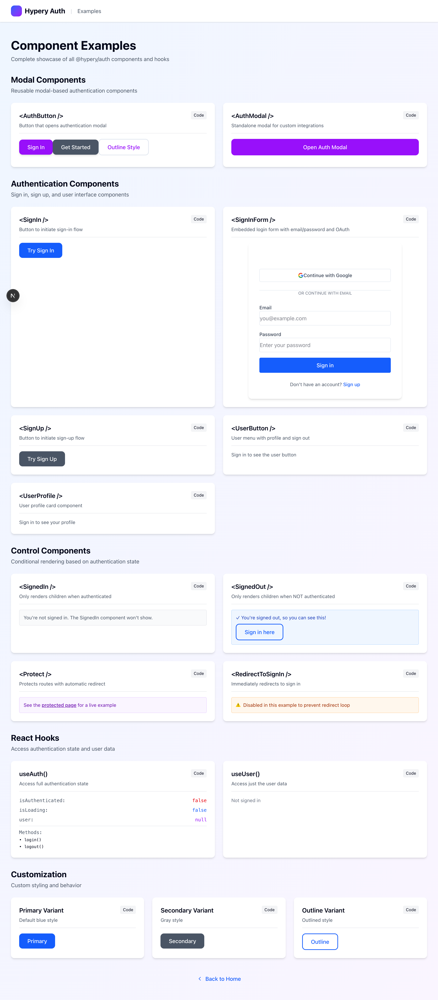
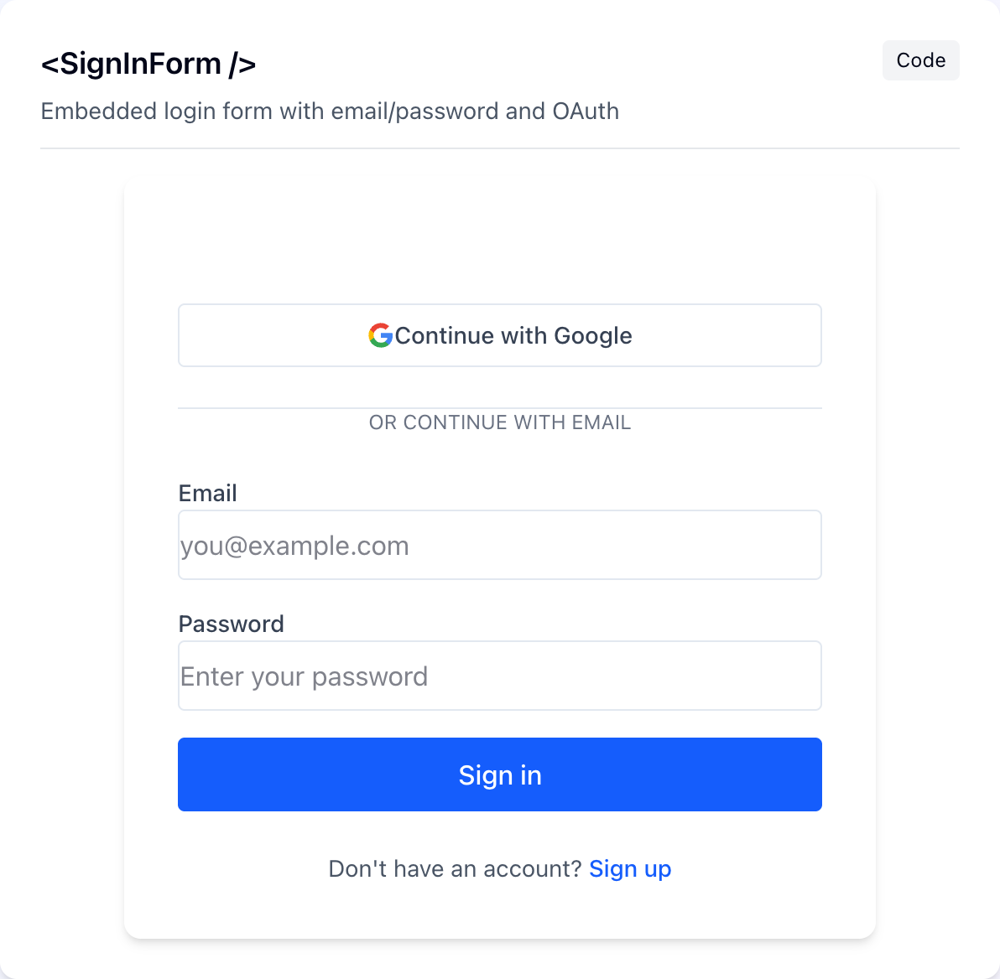
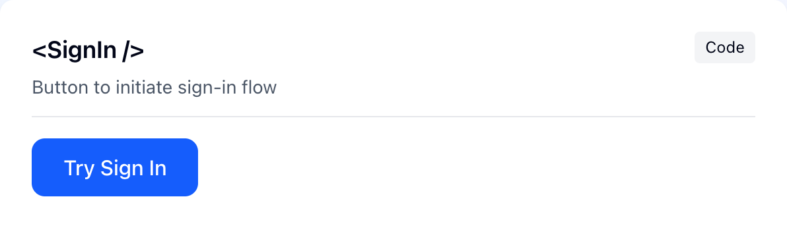
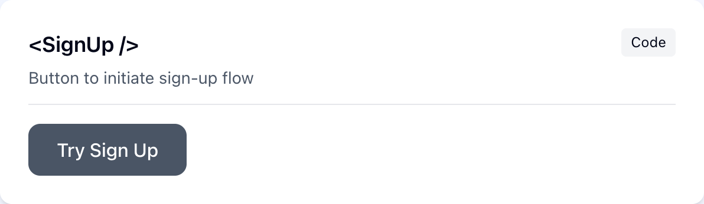
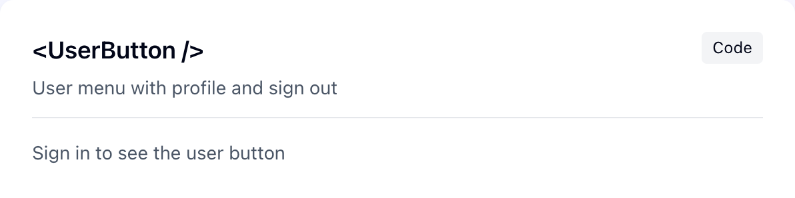
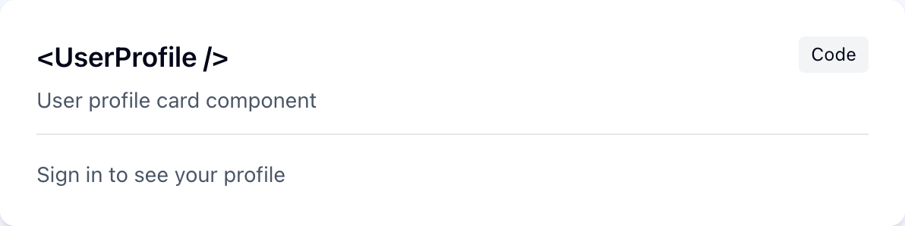

# @hypery/auth — React Component Gallery

Drop-in **authentication components** for any React/Next.js app that signs users in
through the Hypery gateway. Every screenshot below is a real render of the component
from the `auth-demo` example in [hypery-examples](https://github.com/hyperyai/hypery-examples).

> Quick links: [Setup](#setup) · [Auth components](#authentication-components) · [Control components](#conditional-rendering) · [Hooks](#hooks) · [Billing components](#billing-components)

---

## Setup

Wrap your app once in `HyperyProvider`. All components and hooks read from it.

```tsx
// app/layout.tsx (Next.js App Router)
import { HyperyProvider } from '@hypery/auth';

export default function RootLayout({ children }) {
  return (
    <html>
      <body>
        <HyperyProvider
          config={{
            clientId: process.env.NEXT_PUBLIC_OAUTH_CLIENT_ID!,
            redirectUri: process.env.NEXT_PUBLIC_REDIRECT_URI!,   // e.g. https://yourapp.com/callback
            gatewayUrl: process.env.NEXT_PUBLIC_AUTH_URL!,        // the Hypery gateway, e.g. https://api.hypery.ai
            scopes: ['read', 'write', 'ai:chat', 'billing:read'],
            storage: 'localStorage',
          }}
        >
          {children}
        </HyperyProvider>
      </body>
    </html>
  );
}
```

The full component gallery (the screenshots below come from this page):



---

## Authentication components

### `<SignInForm />`

An embedded email/password + social login card. Use it when you want sign-in to live
**inline** on a page rather than behind a modal or redirect.



```tsx
import { SignInForm } from '@hypery/auth';

<SignInForm
  showSocial            // Continue with Google / GitHub
  showEmailPassword
  title="Welcome back"
  description="Sign in to continue"
  onSuccess={(user) => router.push('/dashboard')}
  onError={(err) => toast.error(err.message)}
/>
```

| Prop | Type | Description |
|---|---|---|
| `showCard` | `boolean` | Wrap in a card surface (default true) |
| `showSocial` | `boolean` | Show Google/GitHub buttons |
| `showEmailPassword` | `boolean` | Show the email/password form |
| `title` / `description` | `string` | Heading copy |
| `onSuccess` / `onError` | `(arg) => void` | Result callbacks |

---

### `<AuthModal />`

A controlled modal for sign-in / sign-up — ideal for "Sign in" buttons in a navbar.
Supports custom branding (logo, app name, primary color).


```tsx
import { AuthModal } from '@hypery/auth';

const [open, setOpen] = useState(false);

<button onClick={() => setOpen(true)}>Sign in</button>
<AuthModal
  isOpen={open}
  onClose={() => setOpen(false)}
  initialMode="signin"            // or "signup"
  showSocial
  showEmailPassword
  branding={{ appName: 'Acme', primaryColor: '#6d28d9' }}
  onSuccess={() => setOpen(false)}
/>
```

---

### `<SignIn />` &nbsp;/&nbsp; `<SignUp />`

Drop-in buttons that kick off the sign-in / sign-up flow (modal or redirect). Three
visual variants: `primary`, `secondary`, `outline`.

| `<SignIn />` | `<SignUp />` |
|---|---|
|  |  |

```tsx
import { SignIn, SignUp } from '@hypery/auth';

<SignIn buttonText="Try Sign In" variant="primary" />
<SignUp buttonText="Try Sign Up" variant="secondary" />
```

---

### `<UserButton />` &nbsp;/&nbsp; `<UserProfile />`

`UserButton` is an avatar + dropdown (profile, billing, sign out); `UserProfile` is an
inline profile card. **Both render only when the user is authenticated** — signed out,
they show a placeholder (as captured below).

| `<UserButton />` | `<UserProfile />` |
|---|---|
|  |  |

```tsx
import { UserButton, UserProfile } from '@hypery/auth';

<UserButton showUserInfo size="md" />   // size: 'sm' | 'md' | 'lg'
<UserProfile />
```

---

## Conditional rendering

Render-gate components (no UI of their own — they show/hide children based on auth state).

```tsx
import { SignedIn, SignedOut, Protect, RedirectToSignIn } from '@hypery/auth';

<SignedIn><Dashboard /></SignedIn>
<SignedOut><SignIn /></SignedOut>

{/* Require a scope/permission, with a fallback */}
<Protect scope="billing:read" fallback={<p>No access</p>}>
  <BillingPanel />
</Protect>

{/* Force a redirect to sign-in */}
<SignedOut><RedirectToSignIn /></SignedOut>
```

---

## Hooks

```tsx
import { useUser, useAuth, useError, useWallet, useMemberships } from '@hypery/auth';

const { user, isLoading } = useUser();
const { isAuthenticated, login, logout, getAccessToken } = useAuth();

// Structured gateway errors (spending limit / insufficient credits / payment method)
const { error, setError, clearError, isBillingRestriction } = useError();

// Wallet state + 1-click funding (see Billing components)
const { wallet, addFunds, addPaymentMethod } = useWallet();

// The user's teams + workspaces (for a workspace switcher)
const { data } = useMemberships();
```

---

## Billing components

These render on a consumer site when a request hits a billing limit. They are
**mode-aware** (prepaid vs. metered) and read live wallet state from the gateway:

- **`<RestrictionModal />`** — pops up on `INSUFFICIENT_CREDITS` / `PAYMENT_METHOD_REQUIRED` /
  `SPENDING_LIMIT_EXCEEDED`. In prepaid mode it offers true 1-click **"Add $X"**; in
  metered mode it offers **"Add a payment method"** (Stripe-hosted, no Elements).
- **`<SpendingLimitAlert />`**, **`<InsufficientCreditsAlert />`** — inline alert variants.
- **`useWallet()`** — `wallet.mode`, balance, `addFunds(usd)`, `addPaymentMethod()`.

```tsx
import { RestrictionModal, useError, useAuth } from '@hypery/auth';

const { error, clearError } = useError();
const { getAccessToken } = useAuth();

<RestrictionModal
  error={error}
  gatewayUrl={process.env.NEXT_PUBLIC_AUTH_URL!}
  getAccessToken={getAccessToken}
  onClose={clearError}
  onRetry={retryRequest}
/>
```

See the billing-mode design notes for how prepaid vs. metered is selected.

---

<sub>Screenshots generated from the `auth-demo` example in [hypery-examples](https://github.com/hyperyai/hypery-examples) (`/examples`). To regenerate, run the demo on
`:3003` and re-capture into `docs/screenshots/`.</sub>
