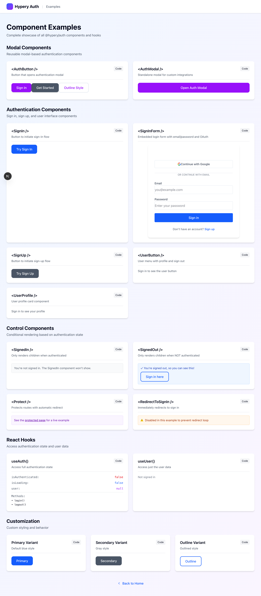
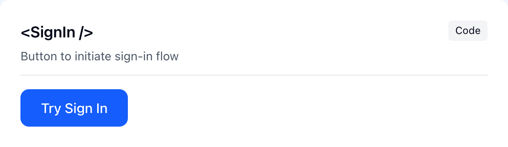
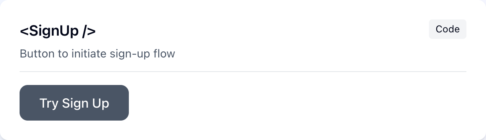
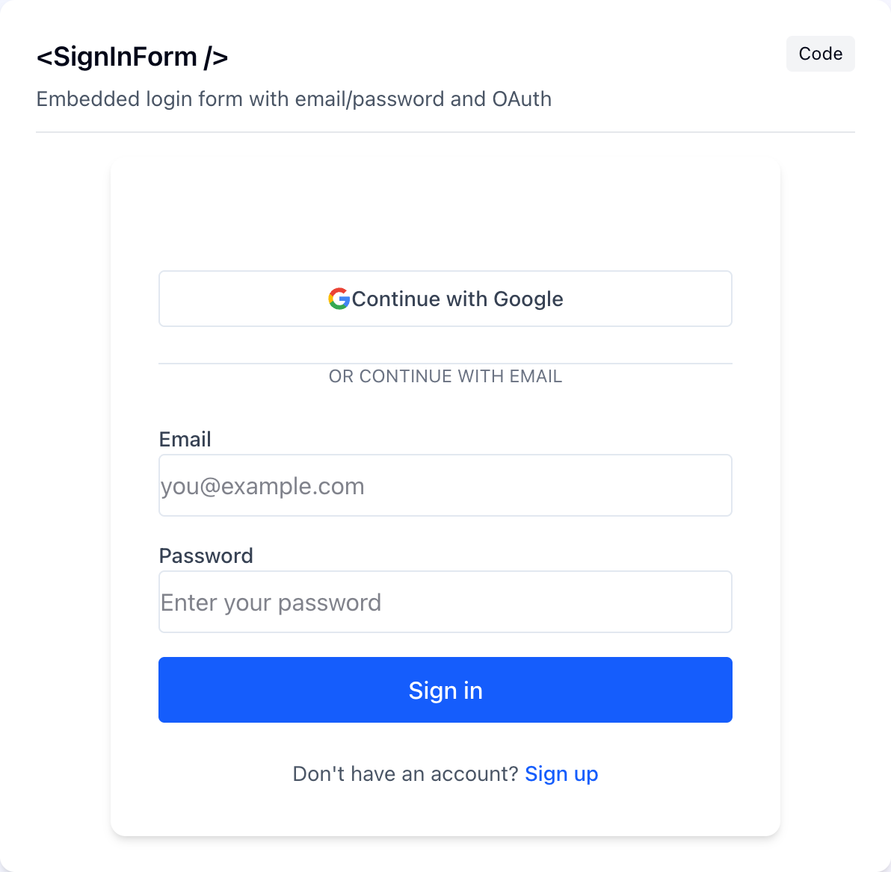
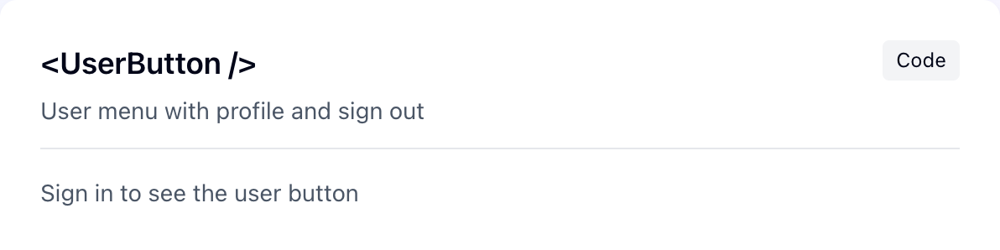
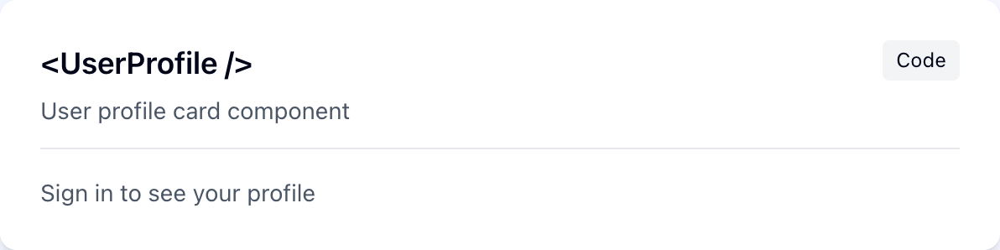

# Components

Drop-in React components for signing users in, gating content and switching
workspaces. Every component must be rendered inside
[`HyperyProvider`](./PROVIDER.md). Components are styled with Tailwind utility
classes, so your app needs Tailwind for the default look; pass `className` to
restyle. Screenshots are real renders from the `auth-demo` example in
[hypery-examples](https://github.com/hyperyai/hypery-examples).

> Back to [README](../README.md) · Checkout buttons: [CHECKOUT.md](./CHECKOUT.md) · Error UI: [ERRORS.md](./ERRORS.md)



Contents: [SignIn](#signin) · [SignUp](#signup) · [SignInForm](#signinform) ·
[AuthButton](#authbutton) · [AuthModal](#authmodal) · [ModernAuthForm](#modernauthform) ·
[UserButton](#userbutton) · [UserProfile](#userprofile) · [WorkspaceSwitcher](#workspaceswitcher) ·
[Control components](#control-components)

A note on auth forms: sign-in is always Hypery's hosted OAuth flow — the SDK
never collects passwords. In `SignInForm`, `AuthModal` and `ModernAuthForm` the
Google/GitHub buttons start login with a `provider` hint (straight to that
identity provider), and the optional "Continue with email" button
(`showEmailPassword`, default `false`) opens the hosted login page. The flow runs
in a popup or a redirect per the provider's `interactionMode` (popup falls back
to redirect when blocked). `onSuccess` fires only once the user is actually
authenticated — after a popup login completes; with a redirect the page
navigates away, so handle post-login on the page at `redirectUri`.

---

## Authentication components

### `SignIn`

A button that calls `login()`. Disabled and labelled "Loading..." while auth is loading.

| `<SignIn />` | `<SignUp />` |
|---|---|
|  |  |

```tsx
import { SignIn } from '@hyperyai/sdk';

<SignIn buttonText="Sign in with Hypery" variant="primary" />
```

| Prop | Type | Default | Description |
| --- | --- | --- | --- |
| `buttonText` | `string` | `'Sign in with Hypery'` | Label. |
| `variant` | `'primary' \| 'secondary' \| 'outline'` | `'primary'` | Built-in style. |
| `className` | `string` | none | Replaces (not appends to) the default classes. |
| `redirectTo` | `string` | none | Saved to `sessionStorage` as `hypery_redirect_after_login`. The SDK does not read it back; your callback page may. |
| `loading` | `boolean` | none | Force the disabled/loading state. |

### `SignUp`

A button that calls `signUp()` (login with `prompt=select_account`), falling back to `login()`.

```tsx
import { SignUp } from '@hyperyai/sdk';

<SignUp buttonText="Get started" onSignUpStart={() => track('signup')} />
```

| Prop | Type | Default | Description |
| --- | --- | --- | --- |
| `buttonText` | `string` | `'Sign up'` | Label. |
| `variant` | `'primary' \| 'secondary' \| 'outline'` | `'primary'` | Built-in style. |
| `className` | `string` | none | Replaces the default classes. |
| `onSignUpStart` | `() => void` | none | Called before the redirect starts. |
| `redirectUrl` | `string` | none | Accepted but currently unused. |

### `SignInForm`

An embedded card with GitHub/Google buttons, an optional "Continue with email"
button and a "Sign up" link.



```tsx
import { SignInForm } from '@hyperyai/sdk';

<SignInForm title="Welcome back" description="Sign in to continue" showEmailPassword={false} />
```

| Prop | Type | Default | Description |
| --- | --- | --- | --- |
| `showCard` | `boolean` | `true` | White card surface. |
| `showTitle` | `boolean` | `true` | Render title + description. |
| `title` | `string` | `'Sign in to continue'` | Heading. |
| `description` | `string` | `'Choose your preferred sign-in method'` | Sub-heading. |
| `showSocial` | `boolean` | `true` | GitHub and Google buttons (login with a `provider` hint). |
| `showEmailPassword` | `boolean` | `false` | "Continue with email" button that opens the hosted login page (see note above). |
| `onSuccess` | `() => void` | none | Called once the user is signed in (see note above). |
| `onError` | `(error: string) => void` | none | Called if starting login throws. |
| `className` | `string` | none | Appended to the container. |

### `AuthButton`

A button that opens an [`AuthModal`](#authmodal).

```tsx
import { AuthButton } from '@hyperyai/sdk';

<AuthButton variant="outline" mode="signup" branding={{ appName: 'Acme' }}>
  Get started
</AuthButton>
```

| Prop | Type | Default | Description |
| --- | --- | --- | --- |
| `children` | `ReactNode` | `'Sign In'` | Label. |
| `variant` | `'primary' \| 'secondary' \| 'outline' \| 'ghost'` | `'primary'` | Style. |
| `size` | `'sm' \| 'md' \| 'lg'` | `'md'` | Size. |
| `className` | `string` | `''` | Appended classes. |
| `mode` | `'signin' \| 'signup'` | `'signin'` | Initial modal mode. |
| `onSuccess` | `() => void` | none | Called once the user is signed in (the modal also closes). |
| `showSocial` | `boolean` | `true` | Forwarded to the modal. |
| `showEmailPassword` | `boolean` | `false` | Forwarded to the modal. |
| `branding` | `BrandingConfig` | none | Forwarded to the modal. |

The props type is exported as `AuthButtonProps`.

### `AuthModal`

A controlled sign-in / sign-up dialog with optional branding.


```tsx
import { AuthModal } from '@hyperyai/sdk';

const [open, setOpen] = useState(false);

<button onClick={() => setOpen(true)}>Sign in</button>
<AuthModal
  isOpen={open}
  onClose={() => setOpen(false)}
  initialMode="signin"
  branding={{ appName: 'Acme', primaryColor: '#6d28d9', logo: '/logo.svg' }}
/>
```

| Prop | Type | Default | Description |
| --- | --- | --- | --- |
| `isOpen` | `boolean` | required | Visibility. |
| `onClose` | `() => void` | required | Called when the dialog is dismissed. |
| `initialMode` | `'signin' \| 'signup'` | `'signin'` | Initial mode; the user can toggle. |
| `onSuccess` | `() => void` | none | Called once the user is signed in (see note above). |
| `onError` | `(error: string) => void` | none | Called if starting login throws. |
| `showSocial` | `boolean` | `true` | Google and GitHub buttons (login with a `provider` hint). |
| `showEmailPassword` | `boolean` | `false` | "Continue with email" button (hosted login page). |
| `branding` | `BrandingConfig` | none | Logo, app name and accent color (default `#8b5cf6`). |

The props type is exported as `AuthModalProps`.

### `ModernAuthForm`

A full-page style auth card with mode switching and a Terms/Privacy footer
(links to `/terms` and `/privacy`).

```tsx
import { ModernAuthForm } from '@hyperyai/sdk';

<ModernAuthForm mode="signin" branding={{ logo: '/logo.png', appName: 'My App' }} />
```

| Prop | Type | Default | Description |
| --- | --- | --- | --- |
| `mode` | `'signin' \| 'signup'` | `'signin'` | Initial mode. |
| `allowModeSwitch` | `boolean` | `true` | Show the sign-in/sign-up toggle. |
| `showCard` | `boolean` | `true` | Card wrapper. |
| `showSocial` | `boolean` | `true` | Google and GitHub buttons (login with a `provider` hint). |
| `showEmailPassword` | `boolean` | `false` | "Continue with email" button (hosted login page). |
| `onSuccess` | `() => void` | none | Called once the user is signed in (see note above). |
| `onError` | `(error: string) => void` | none | Called if starting login throws. |
| `branding` | `BrandingConfig` | none | Logo, app name, accent color. |
| `className` | `string` | `''` | Extra classes. |

The props type is exported as `ModernAuthFormProps`.

---

## User components

### `UserButton`

Avatar button with a dropdown (optional name/email and "Sign out"). Renders
nothing while loading or when signed out.

| `<UserButton />` | `<UserProfile />` |
|---|---|
|  |  |

```tsx
import { UserButton } from '@hyperyai/sdk';

<UserButton
  showUserInfo
  size="md"
  renderDropdown={(user, logout) => (
    <button onClick={logout}>Sign out {user.name}</button>
  )}
/>
```

| Prop | Type | Default | Description |
| --- | --- | --- | --- |
| `showUserInfo` | `boolean` | `false` | Show name and email at the top of the default dropdown. |
| `size` | `'sm' \| 'md' \| 'lg'` | `'md'` | Avatar size. |
| `renderDropdown` | `(user: User, logout: () => void) => ReactNode` | none | Replace the dropdown contents. |
| `className` | `string` | none | Appended to the wrapper. |

### `UserProfile`

Profile card with avatar, name, email and (extended) user id. Renders a
skeleton while loading and nothing when signed out.

```tsx
import { UserProfile } from '@hyperyai/sdk';

<UserProfile showExtended={false} />
```

| Prop | Type | Default | Description |
| --- | --- | --- | --- |
| `showExtended` | `boolean` | `true` | Show user id and status row. |
| `showLoading` | `boolean` | `true` | Show the skeleton while loading. |
| `className` | `string` | none | Replaces the default card classes. |

### `WorkspaceSwitcher`

Dropdown listing every team and workspace the user belongs to (from
[`useMemberships`](./HOOKS.md#usememberships)); selecting one calls
[`setActiveWorkspace`](./HOOKS.md#setactiveworkspace). The personal team is
labelled "Personal". Renders nothing when there are no memberships. Uses
`lucide-react` icons.

```tsx
import { WorkspaceSwitcher } from '@hyperyai/sdk';

<WorkspaceSwitcher gatewayUrl="https://hypery.ai" onSwitched={() => router.refresh()} />
```

| Prop | Type | Default | Description |
| --- | --- | --- | --- |
| `onSwitched` | `(teamId: string, workspaceId: string) => void` | none | Called after a successful switch. |
| `gatewayUrl` | `string` | provider `gatewayUrl` | Base URL for both the membership list and the switch request. Falls back to the provider's `config.gatewayUrl`, then `NEXT_PUBLIC_GATEWAY_URL`, then a relative URL. |
| `className` | `string` | `''` | Appended to the trigger button. |
| `ariaLabel` | `string` | `'Switch workspace'` | Trigger `aria-label`. |

Switch failures are logged to the console, not surfaced. The props type is
exported as `WorkspaceSwitcherProps`.

---

## Control components

Render gates with no UI of their own.

```tsx
import { SignedIn, SignedOut, Protect, RedirectToSignIn } from '@hyperyai/sdk';

<SignedIn fallback={<Spinner />}><Dashboard /></SignedIn>
<SignedOut><SignIn /></SignedOut>

<Protect fallback={<p>Please sign in</p>}>
  <Settings />
</Protect>

<SignedOut><RedirectToSignIn /></SignedOut>
```

### `SignedIn`

| Prop | Type | Description |
| --- | --- | --- |
| `children` | `ReactNode` | Rendered when authenticated. |
| `fallback` | `ReactNode` | Rendered only while auth is loading. |

### `SignedOut`

| Prop | Type | Description |
| --- | --- | --- |
| `children` | `ReactNode` | Rendered when not authenticated. |
| `fallback` | `ReactNode` | Rendered only while auth is loading. |

### `RedirectToSignIn`

No props. Once loading has finished and the user is not authenticated, calls
`login()` (a redirect) from an effect — never during render — and only once per
mount (safe under React StrictMode). Renders nothing.

### `Protect`

| Prop | Type | Description |
| --- | --- | --- |
| `children` | `ReactNode` | Rendered when authenticated. |
| `fallback` | `ReactNode` | Rendered while loading, while logging out, and when signed out. |
| `onUnauthenticated` | `() => void` | When signed out, called (and nothing is rendered) instead of rendering `fallback` or redirecting. |

When signed out with neither `fallback` nor `onUnauthenticated`, `Protect` calls
`login()`. Both `onUnauthenticated` and `login()` run from an effect after auth
has finished loading — never during render — once per mount (StrictMode-safe).
It has no scope/permission prop.

---

<sub>Screenshots generated from the `auth-demo` example in [hypery-examples](https://github.com/hyperyai/hypery-examples) (`/examples`). To regenerate, run the demo on
`:3003` and re-capture into `docs/screenshots/`.</sub>
